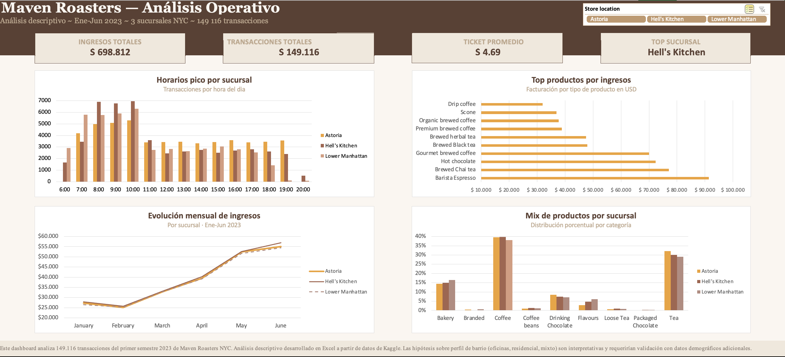

# Maven Roasters — Análisis Operativo

> Disponible en / available in [English](README-ENG.md)

---

## Apertura de negocio

Tres sucursales. Volúmenes similares. Ingresos similares. ¿El mismo negocio? No.

El análisis de 149.116 transacciones del primer semestre 2023 de Maven Roasters NYC revela que las tres sucursales tienen perfiles operativos estructuralmente distintos. Lower Manhattan colapsa después del mediodía. Astoria mantiene actividad estable todo el día. Hell's Kitchen sostiene tráfico hasta las 20hs. El menú estandarizado funciona. La operación estandarizada, no.

**Insight central:** Las diferencias entre sucursales no están en qué compran los clientes, sino en cuándo compran. Eso tiene implicaciones directas para staffing, horarios e inventario — sin necesidad de rediseñar el menú.

---

## Apertura técnica

Análisis descriptivo end-to-end en Excel sobre un dataset de 149.116 transacciones transaccionales de una cadena de cafeterías ficticia (Kaggle). El proyecto incluye limpieza de datos, ingeniería de features, análisis multidimensional con PivotTables y PivotCharts, y un dashboard ejecutivo interactivo con KPIs dinámicos y segmentación por sucursal.

**Stack:** Excel (Tablas estructuradas, PivotTables, PivotCharts, fórmulas, Slicers)

---

## El dataset

| Campo | Detalle |
|---|---|
| Fuente | Kaggle — Coffee Shop Sales |
| Empresa ficticia | Maven Roasters, cadena de cafeterías NYC |
| Sucursales | Astoria · Hell's Kitchen · Lower Manhattan |
| Período | Enero–Junio 2023 (6 meses) |
| Transacciones | 149.116 |
| Calidad | Sin nulos · Sin duplicados · Limpieza mínima necesaria |

---

## Estructura del archivo Excel

| Hoja | Contenido |
|---|---|
| `raw_data` | Datos crudos sin modificar — fuente de verdad auditable |
| `clean_data` | Datos limpios + 7 columnas calculadas (Tabla `tbl_clean`) |
| `horarios` | P1 — Horarios pico y valles por sucursal |
| `perfiles_sucursal` | P2 — Mix de productos por sucursal |
| `volumen_vs_ingresos` | P3 — Volumen vs. ingresos por producto |
| `productos_zombies` | P4 — Productos de bajo rendimiento |
| `evolucion_mensual` | P5 — Evolución temporal del negocio |
| `mix_horario` | P6 — Mix de productos por franja horaria |
| `Dashboard` | Dashboard ejecutivo con KPIs dinámicos y slicer por sucursal |
| `datos_kpis` | Pivots auxiliares que alimentan los KPIs del dashboard |

---

## Las 6 preguntas de análisis

### P1 — ¿Cuándo compran los clientes en cada sucursal?

**Configuración:** Pivot con `hour` en filas, `store_location` como series, filtro `is_weekend`. Gráfico de barras agrupadas.

**Hallazgos:**
- Hell's Kitchen alcanza ~7.000 transacciones/hora entre las 8 y las 10 en días laborales — el pico más alto de las tres sucursales.
- Lower Manhattan tiene "tarde fantasma": cae de 3.000 a 1.400 transacciones entre las 14 y las 18. Los fines de semana casi no tiene actividad.
- Astoria mantiene ~3.500 transacciones estables durante todo el día, todos los días.
- La comparación weekday vs. weekend confirma perfiles de barrio diferenciados: oficinas (Lower Manhattan), residencial (Astoria), mixto (Hell's Kitchen).

**Insight:** Las tres sucursales sirven a perfiles de cliente estructuralmente distintos, validados por comportamiento diferenciado entre días laborales y fines de semana.

---

### P2 — ¿Las tres sucursales tienen el mismo mix de productos?

**Configuración:** Pivot con `product_category` en filas, `store_location` en columnas, valores como % del total de la columna.

**Hallazgos:**
- Coffee (38–40%) y Tea (29–32%) dominan en las tres sucursales. Diferencias entre locales: 2–3 puntos porcentuales.
- Lower Manhattan tiene ligeramente más Bakery (16,5%) y Flavours (6,1%) — coherente con perfil de oficinas.
- Astoria tiene más Tea (32,1%) y Drinking Chocolate (8,5%) — coherente con perfil residencial.

**Insight:** La diferenciación entre sucursales está en *cuándo* compran (P1), no en *qué* compran (P2). El menú estandarizado funciona. La operación estandarizada, no.

---

### P3 — ¿Qué productos generan más volumen y cuáles más ingresos?

**Configuración:** 4 pivots — dos completas (29 product types) para auditoría, dos filtradas al Top 10 vinculadas a gráficos de barras horizontales.

**Hallazgos:**
- Líder por volumen: Brewed Chai tea (17.183 transacciones, ticket $4,49).
- Líder por ingresos: Barista Espresso ($91.406 — vende 5% menos que el líder de volumen pero genera 18% más de ingresos, ticket $5,57).
- Tres tipos de productos: top performers (alto volumen + altos ingresos), premium (bajo volumen + ticket alto), volumen barato (alta rotación + ticket bajo).

**Insight:** Promover el producto más vendido no es lo mismo que promover el más rentable.

---

### P4 — ¿Hay productos que no justifican su lugar en el menú?

**Configuración:** Pivot Bottom 10 por recuento de transacciones, ordenada de menor a mayor.

**Hallazgos:**
- Productos redundantes (candidatos a discontinuación): Black tea (303), Herbal tea (305), Drinking Chocolate genérico (266), Green tea (159), Green beans (134). Compiten con variantes Brewed con volúmenes 30–40 veces mayores.
- Productos estratégicos de bajo volumen (conservar): granos para llevar, Clothing, Organic Chocolate. Cumplen funciones de fidelización y branding, no de revenue.

**Insight:** Bajo volumen no siempre significa zombie. La recomendación de poda aplica a 5 productos específicos, no al Bottom 10 completo.

---

### P5 — ¿Cómo evolucionó el negocio en el primer semestre?

**Configuración:** Dos pivots gemelas — volumen e ingresos — con `month` en filas y `store_location` en columnas. Dos gráficos de líneas vinculados.

**Hallazgos:**
- Las tres sucursales crecieron al mismo ritmo: curvas casi idénticas mes a mes.
- Febrero fue el mes más débil (–6% vs. enero).
- Crecimiento sostenido marzo–junio: +68% en volumen en 4 meses.
- El crecimiento es generalizado, no atribuible a una sucursal en particular.

**Insight:** La diferenciación operativa entre sucursales (P1 y P2) no se traslada a la dimensión temporal. El factor de crecimiento es macro, no operativo.

---

### P6 — ¿Cambia el mix de productos según la franja horaria?

**Configuración:** Pivot con `time_period` en filas, `product_category` en columnas, valores como % del total de la fila. Filtro por `store_location`. Sin gráfico (decisión documentada — ver decisiones técnicas).

**Hallazgos:**
- Bakery tiene leve pico en la mañana (14–17%) en las tres sucursales.
- Tea gana share progresivamente hacia la tarde-noche.
- La comparación entre sucursales en franja mañana confirma los perfiles: más Flavours en Lower Manhattan, más Tea en Astoria, mix intermedio en Hell's Kitchen.

**Insight:** Los perfiles diferenciados de P1 y P2 se sostienen al desagregar por franja horaria. Robustece el insight central del proyecto.

---

## Insight central del proyecto

> Las 3 sucursales de Maven Roasters NO son el mismo negocio. Tienen volumen e ingresos similares pero perfiles operativos distintos. El menú estandarizado funciona. La operación estandarizada, no. Deberían operarse de manera diferenciada.

---

## Dashboard ejecutivo

El dashboard incluye:
- 4 KPIs dinámicos que se actualizan en runtime al filtrar por sucursal.
- Slicer vinculado a los 4 gráficos y a los KPIs simultáneamente.
- Grid 2×2 de gráficos: horarios pico · top productos por ingresos · evolución mensual · mix de productos.
- Paleta consistente con asignación de color por sucursal en todos los gráficos.

---

## Decisiones técnicas y metodología

### 1. Limpieza mínima necesaria
El dataset no tenía nulos ni duplicados. Se aplicaron únicamente las transformaciones requeridas para el análisis: conversión de tipos de datos, ajuste del separador decimal (`unit_price`: `.` → `,` por configuración regional) y creación de columnas calculadas. No se modificaron los datos originales.

### 2. raw_data intocada como fuente de verdad
`clean_data` es una copia de `raw_data`. La hoja original permanece sin modificar para garantizar reproducibilidad y auditoría. Cualquier analista puede reconstruir el análisis desde cero.

### 3. Estructura como Tabla formal (`tbl_clean`)
`clean_data` fue convertida a Tabla estructurada de Excel con nombre `tbl_clean`. Esto habilita referencias estructuradas, filtros automáticos y expansión automática al agregar filas — estándar para análisis escalables en Excel.

### 4. Columnas calculadas justificadas analíticamente
Cada columna nueva responde a una necesidad de agrupación específica: `hour` (separada de `transaction_time`) para habilitar agrupación horaria en pivots; `time_period` para análisis por franja; `is_weekend` para comparación weekday/weekend; `month_num` para ordenamiento correcto de meses en gráficos.

### 5. Cortes de franja horaria basados en lógica de negocio
Mañana `<11`, Mediodía `11–13`, Tarde `14–17`, Noche `18+`. Los cortes responden al comportamiento real de una cafetería (rush mañanero, almuerzo, tarde estable, noche residual), no a división matemática del día.

### 6. Doble pivot por pregunta (auditoría + visualización)
P3 y P4 usan dos pivots: una completa (todos los productos, para auditoría) y una filtrada Top/Bottom 10 vinculada al gráfico. Esto preserva la visibilidad de datos completos sin sacrificar la legibilidad visual.

### 7. PivotCharts vinculados directamente a pivots
Se evitaron tablas auxiliares duplicadas. Los gráficos se conectan directamente a las pivots para mantener integridad referencial y eliminar margen de error por duplicación manual de datos.

### 8. Decisión de no incluir gráfico en P6
Las diferencias entre franjas horarias y entre sucursales en P6 son sutiles (2–3 puntos porcentuales). Un gráfico tendría bajo poder explicativo. La tabla con porcentajes formateados comunica el insight con mayor claridad. Decisión documentada explícitamente.

### 9. KPIs dinámicos basados en pivots auxiliares
Los 4 KPIs del dashboard no usan fórmulas directas sobre `tbl_clean` sino referencias a pivots auxiliares en la hoja `datos_kpis`. Esto permite que el slicer del dashboard controle simultáneamente los gráficos y los KPIs. Los valores se actualizan en runtime al cambiar la selección del slicer.

### 10. Hipótesis de perfiles de barrio como interpretativas
Las conclusiones sobre el tipo de barrio (oficinas, residencial, mixto) están basadas exclusivamente en patrones transaccionales. Se presentan explícitamente como hipótesis interpretativas que requerirían validación con datos demográficos externos (ej. NYC Open Data). Esta distinción está documentada en el dashboard y en el reporte.

### 11. Terminología diferenciada por audiencia
"Análisis Operativo" en el título del dashboard (audiencia ejecutiva — qué se analizó). "Análisis descriptivo" en subtítulos y README (audiencia técnica — cómo se analizó). La misma distinción se mantiene en el reporte freelance.

---

## Limitaciones y siguientes pasos

**Limitaciones:**
- Solo 6 meses de datos — no es posible identificar estacionalidad anual.
- Sin datos de costos — no se puede calcular margen real por producto.
- Las hipótesis de perfil de barrio requieren validación con fuentes externas.

---

## Stack utilizado

`Excel` · Tablas estructuradas · PivotTables · PivotCharts · Slicers · Fórmulas (`SUMIF`, `AVERAGE`, `IF` anidado, `TEXT`, `HOUR`, `MONTH`)

---

*Proyecto desarrollado por Bonhome María Sol · Data Analytics Portfolio ·*
*Dataset: [Coffee Shop Sales — Kaggle]*
